# Informações do Projeto
`Planejy`  

O Planejy é um projeto criado com o objetivo de ajudar as pessoas que possuem dificuldade em planejar seu dia ou que são afetadas por procrastinarem a realização de tarefas.

A aplicação foi criada pensando justamente em ser rápida, fácil de utilizar e que disponibilize todas as funcionalidades necessárias para um bom planejamento das tarefas.

`Ciência da Computação` 

A Ciência da Computação está amplamente inserida na sociedade contemporânea e exige profissionais em constante qualificação. Na PUC Minas, o aluno aplica os conhecimentos de forma independente, inovadora e criativa, acompanhando a evolução do setor e contribuindo para a busca por novas soluções, por meio da participação em projetos de pesquisa sob a orientação de professores qualificados. 

## Participantes

O projeto está sendo desenvolvido por um grupo de alunos do 1º período de Ciência da Computação da PUC Minas Coração Eucarístico.

> Os membros do grupo são: 
> - Denis Soares de Oliveira Neto
> - Gabriel Martins Vinci Almeida
> - Gabriel Ramos Ferreira
> - João Vitor Romero Sales
> - Marcos Antônio Lommez Cândido Ribeiro
> - Matheus Moreira Sorrentino

# Estrutura do Documento

- [Informações do Projeto](#informações-do-projeto)
  - [Participantes](#participantes)
- [Estrutura do Documento](#estrutura-do-documento)
- [Introdução](#introdução)
  - [Problema](#problema)
  - [Objetivos](#objetivos)
  - [Justificativa](#justificativa)
  - [Público-Alvo](#público-alvo)
- [Especificações do Projeto](#especificações-do-projeto)
  - [Personas e Mapas de Empatia](#personas-e-mapas-de-empatia)
  - [Histórias de Usuários](#histórias-de-usuários)
  - [Requisitos](#requisitos)
    - [Requisitos Funcionais](#requisitos-funcionais)
    - [Requisitos não Funcionais](#requisitos-não-funcionais)
  - [Restrições](#restrições)
- [Projeto de Interface](#projeto-de-interface)
  - [User Flow](#user-flow)
  - [Wireframes](#wireframes)
- [Metodologia](#metodologia)
  - [Divisão de Papéis](#divisão-de-papéis)
  - [Ferramentas](#ferramentas)
  - [Controle de Versão](#controle-de-versão)
- [**############## SPRINT 1 ACABA AQUI #############**](#-sprint-1-acaba-aqui-)
- [Projeto da Solução](#projeto-da-solução)
  - [Tecnologias Utilizadas](#tecnologias-utilizadas)
  - [Arquitetura da solução](#arquitetura-da-solução)
- [Avaliação da Aplicação](#avaliação-da-aplicação)
  - [Plano de Testes](#plano-de-testes)
  - [Ferramentas de Testes (Opcional)](#ferramentas-de-testes-opcional)
  - [Registros de Testes](#registros-de-testes)
- [Referências](#referências)

# Introdução

## Problema

Milhões de pessoas todos os dias sofrem por falta de organização e não realizam todos os seus afazeres. Às vezes, podemos pensar que este problema afeta somente pessoas muito atarefadas como executivos e pessoas com várias reuniões diárias, mas o que acaba acontecendo é que até mesmo pessoas com menos tarefas que não sabem fazer uma organização otimizada que neutralize as chances de procrastinar, podem acabar criando uma bola de neve que certamente trará dor de cabeça no futuro.

Tendo isto em vista, o grupo decidiu abordar esse problema como tema de seu projeto da matéria Trabalho Interdisciplinar Aplicações Web (TIAW). Temos como objetivo ajudar e melhorar a vida das pessoas, tornando-as mais organizadas e focadas nos estudos e no trabalho.

## Objetivos

Dentre os objetivos do projeto, temos como foco principal o desenvolvimento de um software que ajudará seus usuários a otimizarem a organização de sua rotina durante a semana. Além disso, é muito importante para nós conscientizar as pessoas sobre a importância da organização pessoal para o sucesso na vida.
Pretendemos também, através dos recursos do software, despertar o interesse dos usuários acerca dos métodos de estudo sugeridos por especialistas. Fazendo com que o software seja ideal para alguém que deseja conciliar os estudos com outras atividades.

## Justificativa

O motivo que levou nosso grupo a querer trabalhar nesse projeto e torná-lo algo real é a quantidade de pessoas que apresentam problemas com organização atualmente. A procrastinação já esteve presente na vida de qualquer um e em alguns casos ela pode se tornar algo recorrente e que faz muitas pessoas desistirem de suas metas e sonhos. A importância desse projeto foi mostrada de forma concreta quando fizemos uma pesquisa com mais de 40 pessoas em ambientes distintos, e pudemos observar que mais de 85% dessas pessoas possuem problemas relacionados à falta de organização e procrastinação, porém, não sabem como resolvê-los. Dessa forma, estamos motivados e temos conhecimento da dimensão desse problema e o que ele causa em nossa sociedade.

## Público-Alvo

O público-alvo do nosso software se consiste em pessoas que possuem dificuldade de organizar sua rotina, seja ela simples ou bem carregada. Como esse problema atinge perfis que podem ser totalmente diferente, visamos a facilidade para o uso dos recursos pelo usuário, porém, com recursos muito completos, que atendem essas diferentes características.
O nosso software pretende ajudar qualquer pessoa que precise de otimizar sua rotina, portanto nosso objetivo é que tanto alguém que tenha o mínimo de conhecimento tecnológico e que precise de nós apenas para lembrar de marcar o psicólogo semanalmente, quanto outro usuário que trabalha durante todo o dia e estuda pela noite e precisa conciliar os afazeres da faculdade e do trabalho possam utilizar nossos recursos com facilidade.

# Especificações do Projeto

Para garantir produtividade e avanço em nosso projeto, utilizamos primeiramente técnicas para melhor entendimento e discussão do problema, como a Matriz de Alinhamento CSD, Mapa de Stakeholders e a criação de personas. Em seguida, montamos questões por meio do google forms, para nos guiar nas conversas com os voluntários que nos ajudariam a entender melhor o que as pessoas com essa dor enfrentam. Após entender melhor o problema sobre o qual trataremos, utilizamos métodos de Brainstorming para organizar nossas ideias para o software, anotando tudo com a template disponibilizada no Miro. A descrição mais detalhada das ferramentas utilizadas em todo o processo, se encontra em [Ferramentas](#ferramentas).

## Personas e Mapas de Empatia

Utilizando a template do Miro, montamos três personas que seriam possíveis clientes de nosso software, para que dessa forma tivessemos uma ideia mais clara sobre como o Planejy deve ser e quais utilidades essas personas precisam.

> **Primeira Persona**
> 
> 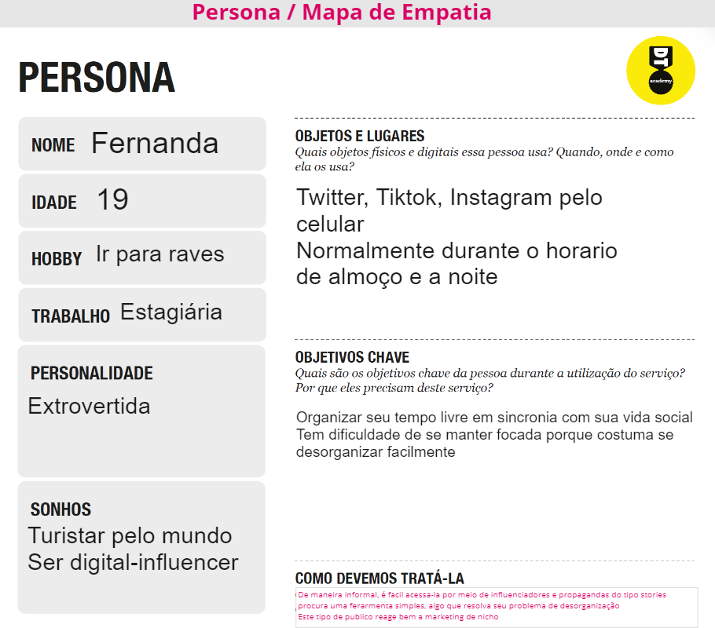
>
> 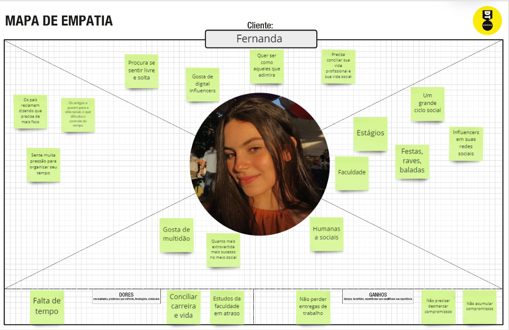
> 
> **Segunda Persona**
> 
> 
>
> 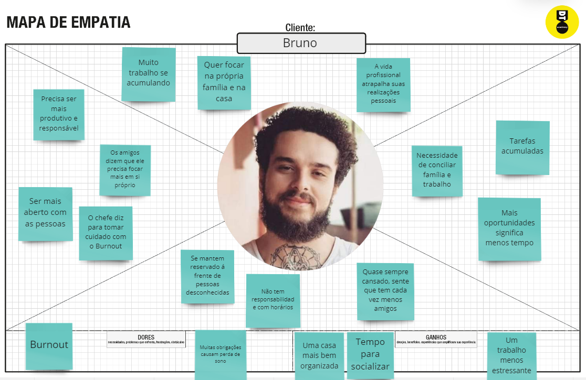
> 
> **Terceira Persona**
> 
> 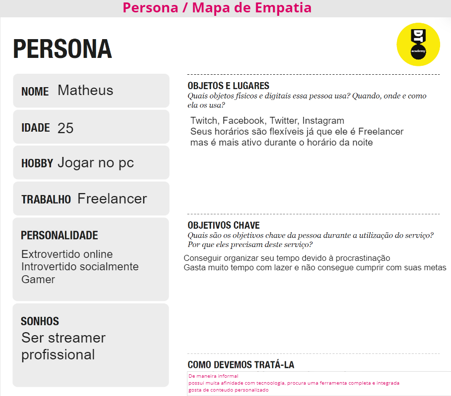
>
> 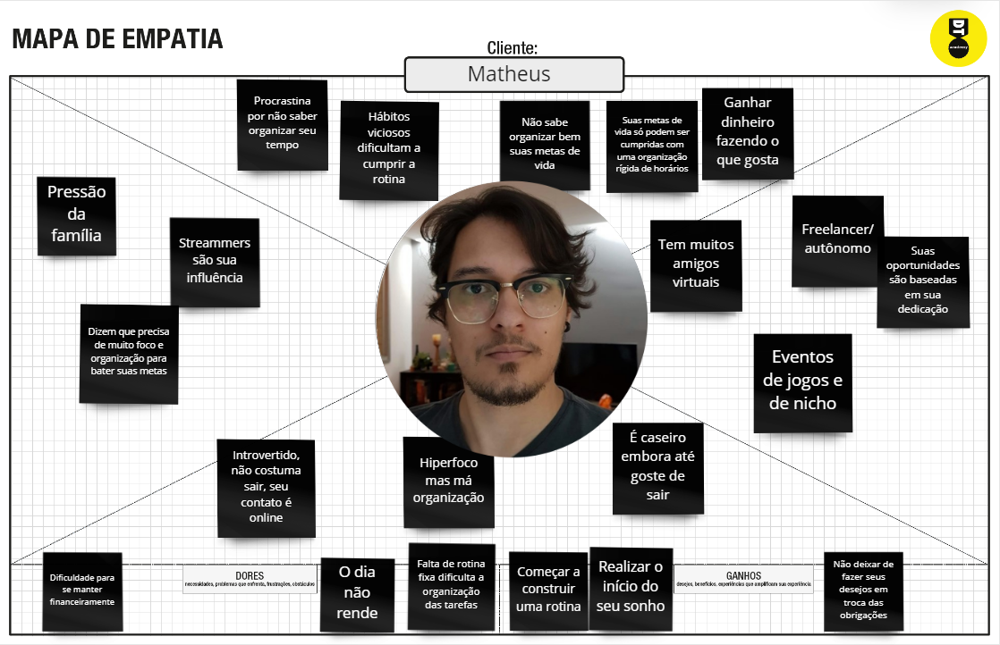

## Histórias de Usuários

Com base na análise das personas forma identificadas as seguintes histórias de usuários:

|EU COMO... `PERSONA`| QUERO/PRECISO ... `FUNCIONALIDADE` |PARA ... `MOTIVO/VALOR`                 |
|--------------------|------------------------------------|----------------------------------------|
|Usuário do sistema  | Registrar minhas tarefas           | Não esquecer de fazê-las               |
|Administrador       | Alterar permissões                 | Permitir que possam administrar contas |

> Apresente aqui as histórias de usuário que são relevantes para o
> projeto de sua solução. As Histórias de Usuário consistem em uma
> ferramenta poderosa para a compreensão e elicitação dos requisitos
> funcionais e não funcionais da sua aplicação. Se possível, agrupe as
> histórias de usuário por contexto, para facilitar consultas
> recorrentes à essa parte do documento.
>
> **Links Úteis**:
> - [Histórias de usuários com exemplos e template](https://www.atlassian.com/br/agile/project-management/user-stories)
> - [Como escrever boas histórias de usuário (User Stories)](https://medium.com/vertice/como-escrever-boas-users-stories-hist%C3%B3rias-de-usu%C3%A1rios-b29c75043fac)

## Requisitos

As tabelas que se seguem apresentam os requisitos funcionais e não funcionais que detalham o escopo do projeto.

### Requisitos Funcionais

|ID    | Descrição do Requisito  | Prioridade |
|------|-----------------------------------------|----|
|RF-001| Relatorio de produtividade | ALTA |
|RF-002| Controle de frequencia de notificacao | ALTA |
|RF-003| Nivel de complexidade customizavel | BAIXA |
|RF-004| Pagina com artigos | ALTA |
|RF-005| Utilizacao de paleta de cores pastel | ALTA |
|RF-006| Calendario com lembretes | ALTA |
|RF-007| Relatorio de produtividade | ALTA |
|RF-008| planner | ALTA |
|RF-009| Diferentes notificacoes e anotacoes | ALTA |
|RF-010| Temas diferentes para o site | BAIXA |
|RF-011| Contato de especialistas e profissionais | MÉDIA |
|RF-012| Integracao multiplataforma | BAIXA |

### Requisitos não Funcionais

|ID     | Descrição do Requisito  |Prioridade |
|-------|-------------------------|----|
|RNF-001| Sistemas de recompensas | MÉDIA | 
|RNF-002| Sistema de fidelidade |  BAIXA | 
|RNF-003| Assistente virtual personalizavel (sistema de recompensas) | BAIXA |
|RNF-004| Assistente virtual que auxiliara o usuario | ALTA |
|RNF-005| Planilha personalizada | ALTA |
|RNF-006| Mensagens incentivadoras | MÉDIA |
|RNF-007| Tela de chat para ajuda | BAIXA |

## Restrições

O projeto está restrito pelos itens apresentados na tabela a seguir.

|ID| Restrição                                             |
|--|-------------------------------------------------------|
|01| O projeto deverá ser entregue até o final do semestre |
|02| Não pode ser desenvolvido um módulo de backend        |
|03| O projeto deve utilizar apenas HTML, CSS, JV          |
|04| O projeto deve ser feito utilizando metodologias      |
|05| A evolucao do projeto deve ser feita em reuniao       |

> Enumere as restrições à sua solução. Lembre-se de que as restrições
> geralmente limitam a solução candidata.
> 
> **Links Úteis**:
> - [O que são Requisitos Funcionais e Requisitos Não Funcionais?](https://codificar.com.br/requisitos-funcionais-nao-funcionais/)
> - [O que são requisitos funcionais e requisitos não funcionais?](https://analisederequisitos.com.br/requisitos-funcionais-e-requisitos-nao-funcionais-o-que-sao/)

# Projeto de Interface

Estamos nos preocupando com a qualidade da interface do usuario sendo ela caracterizada por ser limpa e minimalista, mas extremamente funcional. Sendo assim, o projeto acaba tendo uma identidade visual alem de facil e intuitiva, fortalecendo a fixabilidade da aplicação na rotina de nossos usuarios.

## User Flow

O diagrama a seguir apresenta o fluxo que o usuario ira tomar dentro do site-aplicação
sendo a tela incial um login juntamente com uma apresentacao simples do aplicativo
Para visualizar o wireframe interativo acesse: https://www.figma.com/proto/U4ycqEjCBOnQNSwdEny9Kf/Untitled?node-id=3%3A86&scaling=min-zoom&page-id=0%3A1&starting-point-node-id=3%3A86

Para visualizar o wireframe pelo aplicativo do figma acesse: https://www.figma.com/file/U4ycqEjCBOnQNSwdEny9Kf/Untitled?node-id=6%3A1339

## Wireframes

De acordo com o userflow apresentado no artigo acima o site tera uma tela de login distinta a sua funcionalidade
Sobre esta primeira tela, ela sera separada em 2 partes
Barra esquerda - Explicacoes e breves resumos sobre o site
Tela interativa - possuira a parte de login ou recuperacao de senha

Esta tela principal sera divida em 5 subdivisoes sendo estas:

1 - Home/Login

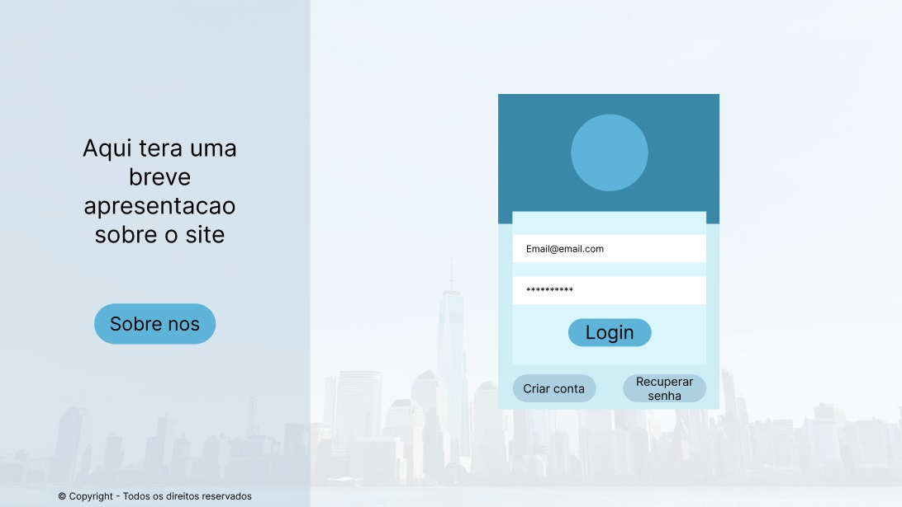

2 - Recuperar Senha

3 - Criar Conta

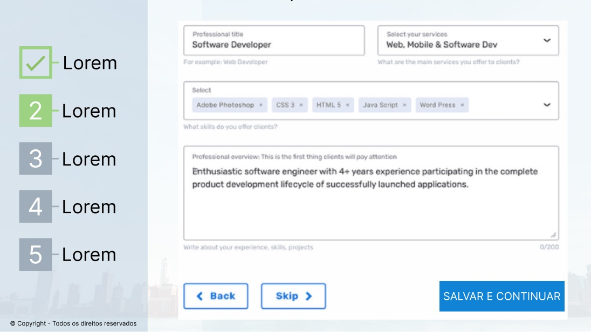

4 - Sobre Nos

Conforme se segue o fluxo ira para a tela principal do site onde terao 3 telas principais
Estas telas terao sempre um padrao de barra lateral, com ajustes, configuracoes, opcoes extras e navegacoes
A barra lateral possuira notas padronizadas e personalizadas que poderao ser indexadas ao Planner/Calendario
Assim sendo estas telas serao:

1 - Planner

Sera a tela inicial do site, com as informacoes necessarias com facil visualizacao
As notas serao dispostas baseadas em tempo de duracao, nivel de relevancia e sua categoria
sera uma especie de calendario de visualizacao semanal

2 - Calendario

Uma versao modificada do Planner onde as informacoes serao dispostas baseadas em um calendario mensal

3 - Notas

Puramente as notas em ordem cronologica ou de importancia, sem marcacao de dias

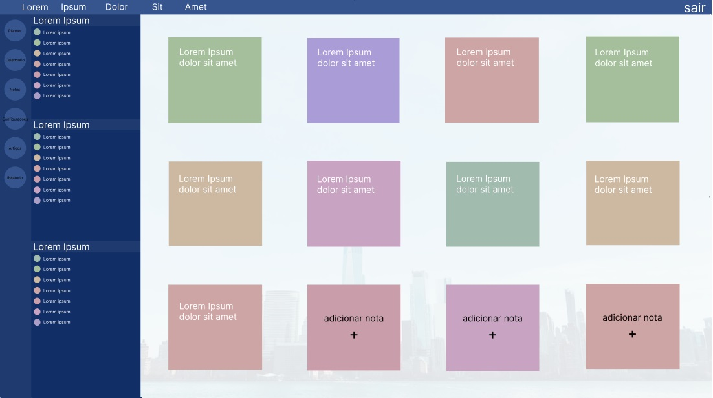

3.2 - Adicionar notas

Uma tela dedicada a configuracao da nota, para aquelas pessoas que buscam uma experiencia mais avancada de como configurar sua rotina

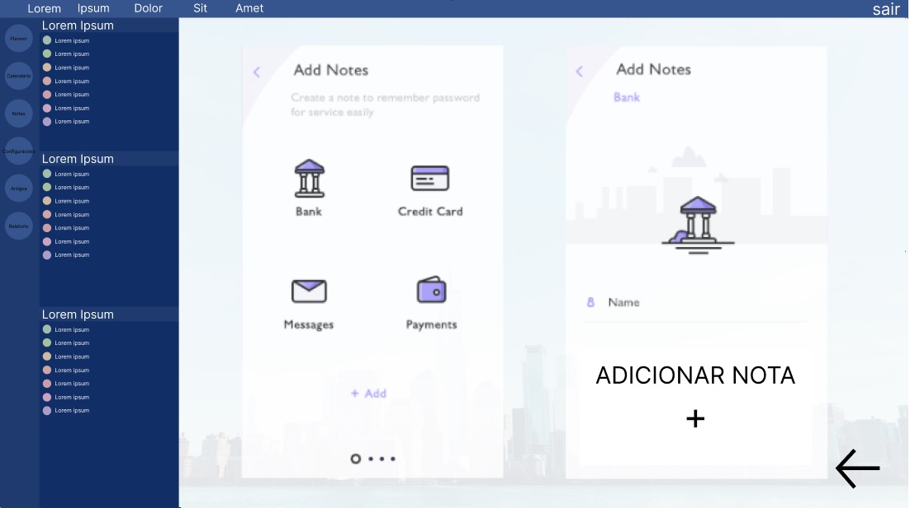

A partir destas existirao as telas secundarias que nao visam a visualizacao das notas e sim uma experiencia mais avancada para aqueles que buscam profundidade no aplicativo
estas serao:

1 - Relatorio

Parte dedicada a ver estatisticas de como sua experiencia esta ocorrendo
assim como relatado na pesquisa 100% das pessoas responderam que acreditavam que uma melhor organizacao de sua vida traria melhorias significativas a sua vida pessoal e profissional, impactando diretamente seu rendimento financeiro e uma melhor qualidade de vida
por isso a importancia de um relatorio, para que possa ser provado diretamente ao usuario a diferenca da utilizacao do site

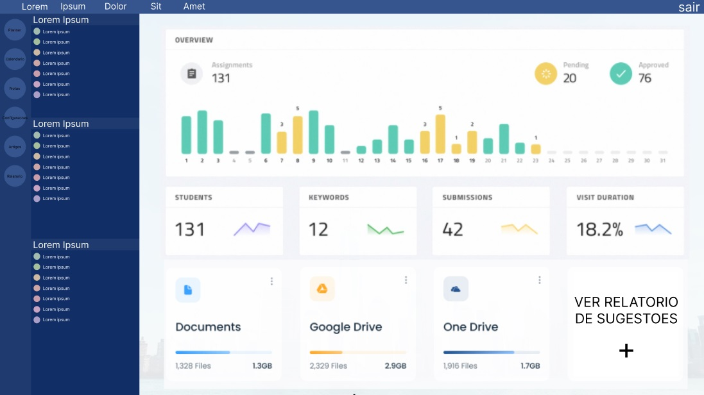

1.2 - Sugestoes

Sessao baseada em analisar os dados do usuario para aqueles que buscam uma experiencia o mais avancada possivel
tendo retorno de artigos profissionais ou contato com profissionais que possam auxiliar em seu crescimento, baseado naquilo que gera a origem de seu problema

2 - Artigos

Os artigos sao baseados em sessoes de auto-ajuda, recomendacao de livros, tecnicas e metodos que possam complementar a rotina de quem utiliza a aplicacao

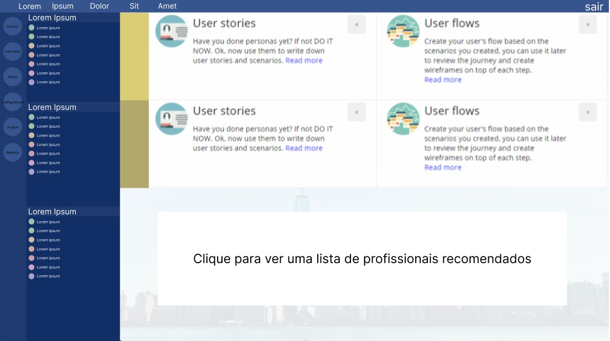

2.2 - Profissionais

Lista de profissionais parceiros que podem auxiliar o usuario, baseados em suas necessidades que o levaram a procurar um site/aplicacao sobre procrastinacao e organizacao

Alem destas telas existira a parte de configuracoes, que se divide em duas:

1 - Configuracoes

configuracoes da conta em geral e tudo aquilo que abrange a experiencia do usuario

2 - Personalizacao

pessoas com necessidades diferentes precisam de ambientes diferentes
nosso site abrange publicos com caracteristicas que distinguem de procurar uma experiencia basica ou avancada ou gosto por temas que se encaixam melhor em sua personalidade, como os classicos temas claro e escuro

# Metodologia

A metodologia que usamos contemplou o uso de diversas ferramentas de trabalho para assim uma melhor diversificacao de funcoes no grupo.
Foram utilizados: 
Github para o controle de versao e repositorio de codigo, metodologia, documentacao e tudo aquilo que for feito no projeto

Utilizamos o google forms para fazer uma entrevista com o nosso publico alvo, tendo juntamente a isto a entrevista presencial para uma melhor qualidade de resultados

O Miro foi utilizado para criar e discutir todo o processo de design thinking, todo este foi feito em maior parte presencialmente com todos do grupo e escrito em conjunto atraves da discussao de ideias e analise qualitativa das entrevistas, tanto as realizadas pessoalmente quanto aquelas quantitativas feitas pelo forms

Usamos o Figma para construir o userflow baseado nas ideias discutidas e concluidas atraves do Miro (persona e processo de design thinking) e tentar implementa-las de maneira funcional no site. Junto a isto no Figma tambem foi construido o Wireframe do projeto para servir como base para a construcao do template do site

Por fim durante todo o projeto tambem foi utilizado um grupo no discord para termos controle da divisao de tarefas e divisao de funcoes, estas cujo quais ficaram muito bem definidas sendo um membro lider de cada parte do projeto para guiar e delegar as funcoes relacionadas a sua parte para os outros membros do grupo

Decidimos alem disto utilizar o VSCode para escrevermos o codigo do programa
E a ferramenta Trello foi decidida para fazer a divisao de tarefas que sera realizada durante a criacao do codigo do site

Utilizamos por fim o Google Presentation para fazer a criacao de slides de apresentacao para explicar o nosso projeto, que foi feito junto do Slidesgo onde foi retirado o modelo de apresentacao utilizado

## Divisão de Papéis

  Além das funções pré-definidas abaixo, todos os membros do grupo participaram da elaboração de determinadas partes do projeto, como o Miro, e algumas participaram de outras pequenas partes, fora das suas específicas.

> Matheus - Repositório Github

> Marcos Antônio - Repositório Github e Figma

> Gabriel Ramos - Documentação

> Dênis Soares - Documentação

> João Vitor Romero - Apresentação slides, Figma e um pouco do Github

> Gabriel Vinci - Apresentação slides

## Ferramentas

Assim como explicado acima aqui estao o link das ferramentas utilizadas juntamente com o link do nosso projeto dentro delas

| Ambiente  | Plataforma              |Link de Acesso |
|-----------|-------------------------|---------------|
|Processo de Design Thinkgin  | Miro | https://miro.com/app/board/uXjVOAUNaP0=/ | 
|Repositório de código | GitHub | https://github.com/ICEI-PUC-Minas-PMGCC-TI/tiaw-pmg-cc-m-20221-procrastinacao-1-t1-g7 |
|Protótipo Interativo | Figma | https://www.figma.com/file/U4ycqEjCBOnQNSwdEny9Kf/Untitled?node-id=6%3A1339 | 
|Editor de código | VSCode | https://code.visualstudio.com | 
|Comunicação entre o grupo | Discord | https://discord.gg/bvRCNbwk |
|Formulario do google | Forms | https://forms.gle/dHjjc395aqf5xT1y8 |
|Padrao de slides | Slidesgo | https://slidesgo.com/pt |
|Criacao de slides | Workspace | https://workspace.google.com/intl/pt-BR/products/slides |
|Resultado da pesquisa | Forms | https://docs.google.com/forms/d/1JsHhjSWS_8ko8sxOILNrSzmygGmtweiRA6NdtYKjU9k/edit#responses |
|Apresentacao de Slides | Docs | https://docs.google.com/presentation/d/1ap0tOci9GqX-A4SL1uXNS-87tgkDFLg-rE71AcwHzXc/edit?usp=sharing |

## Controle de Versão

O site vai ser divido em versoes que utilizacao 3 digitos sendo estes:
1 - Atualizacao master
2 - Atualizacao parcial estavel
3 - Atualizacao de bugfix ou atualizacao de codigo sem implementacao visual

exemplo:
2.5.1
2 = Segunda grande implementacao estavel
.5 = quinta parte de implementacao parcial, mas ainda nao caracteriza uma mudanca significativa
.1 = bugs corrigidos

Utilizaremos tambem algumas tags para o desenvolvimento

`master`: versão estável já testada do software
`unstable`: versão já testada do software, porém instável
`testing`: versão em testes do software
`dev`: versão de desenvolvimento do software
`bugfix`: uma funcionalidade encontra-se com problemas
`enhancement`: uma funcionalidade precisa ser melhorada
`feature`: uma nova funcionalidade precisa ser introduzida
`description`: uma melhoria no sistema de comentarios do codigo
`root`: uma modificacao na base do sistema
`branch`: uma modificacao que nao modifica outras partes do sistema

# **############## SPRINT 1 ACABA AQUI #############**

# Projeto da Solução

......  COLOQUE AQUI O SEU TEXTO ......

## Tecnologias Utilizadas

......  COLOQUE AQUI O SEU TEXTO ......

> Descreva aqui qual(is) tecnologias você vai usar para resolver o seu
> problema, ou seja, implementar a sua solução. Liste todas as
> tecnologias envolvidas, linguagens a serem utilizadas, serviços web,
> frameworks, bibliotecas, IDEs de desenvolvimento, e ferramentas.
> Apresente também uma figura explicando como as tecnologias estão
> relacionadas ou como uma interação do usuário com o sistema vai ser
> conduzida, por onde ela passa até retornar uma resposta ao usuário.
> 
> Inclua os diagramas de User Flow, esboços criados pelo grupo
> (stoyboards), além dos protótipos de telas (wireframes). Descreva cada
> item textualmente comentando e complementando o que está apresentado
> nas imagens.

## Arquitetura da solução

......  COLOQUE AQUI O SEU TEXTO E O DIAGRAMA DE ARQUITETURA .......

> Inclua um diagrama da solução e descreva os módulos e as tecnologias
> que fazem parte da solução. Discorra sobre o diagrama.
> 
> **Exemplo do diagrama de Arquitetura**:
> 
> 

# Avaliação da Aplicação

......  COLOQUE AQUI O SEU TEXTO ......

> Apresente os cenários de testes utilizados na realização dos testes da
> sua aplicação. Escolha cenários de testes que demonstrem os requisitos
> sendo satisfeitos.

## Plano de Testes

......  COLOQUE AQUI O SEU TEXTO ......

> Enumere quais cenários de testes foram selecionados para teste. Neste
> tópico o grupo deve detalhar quais funcionalidades avaliadas, o grupo
> de usuários que foi escolhido para participar do teste e as
> ferramentas utilizadas.
> 
> **Links Úteis**:
> - [IBM - Criação e Geração de Planos de Teste](https://www.ibm.com/developerworks/br/local/rational/criacao_geracao_planos_testes_software/index.html)
> - [Práticas e Técnicas de Testes Ágeis](http://assiste.serpro.gov.br/serproagil/Apresenta/slides.pdf)
> -  [Teste de Software: Conceitos e tipos de testes](https://blog.onedaytesting.com.br/teste-de-software/)

## Ferramentas de Testes (Opcional)

......  COLOQUE AQUI O SEU TEXTO ......

> Comente sobre as ferramentas de testes utilizadas.
> 
> **Links Úteis**:
> - [Ferramentas de Test para Java Script](https://geekflare.com/javascript-unit-testing/)
> - [UX Tools](https://uxdesign.cc/ux-user-research-and-user-testing-tools-2d339d379dc7)

## Registros de Testes

......  COLOQUE AQUI O SEU TEXTO ......

> Discorra sobre os resultados do teste. Ressaltando pontos fortes e
> fracos identificados na solução. Comente como o grupo pretende atacar
> esses pontos nas próximas iterações. Apresente as falhas detectadas e
> as melhorias geradas a partir dos resultados obtidos nos testes.

# Referências

......  COLOQUE AQUI O SEU TEXTO ......

> Inclua todas as referências (livros, artigos, sites, etc) utilizados
> no desenvolvimento do trabalho.
> 
> **Links Úteis**:
> - [Formato ABNT](https://www.normastecnicas.com/abnt/trabalhos-academicos/referencias/)
> - [Referências Bibliográficas da ABNT](https://comunidade.rockcontent.com/referencia-bibliografica-abnt/)
