# Informações do Projeto
`Planejy`  

O Planejy é um projeto criado com o objetivo de ajudar as pessoas que possuem dificuldade em planejar seu dia ou que são afetadas por procrastinarem a realização de tarefas.

A aplicação foi criada pensando justamente em ser rápida, fácil de utilizar e que disponibilize todas as funcionalidades necessárias para um bom planejamento das tarefas.

`Ciência da Computação` 

A Ciência da Computação está amplamente inserida na sociedade contemporânea e exige profissionais em constante qualificação. Na PUC Minas, o aluno aplica os conhecimentos de forma independente, inovadora e criativa, acompanhando a evolução do setor e contribuindo para a busca por novas soluções, por meio da participação em projetos de pesquisa sob a orientação de professores qualificados. 

## Participantes

O projeto está sendo desenvolvido por um grupo de alunos do 1º período de Ciência da Computação da PUC Minas Coração Eucarístico.

> Os membros do grupo são: 
> - Denis Soares de Oliveira Neto
> - Gabriel Martins Vinci Almeida
> - Gabriel Ramos Ferreira
> - João Vitor Romero Sales
> - Marcos Antônio Lommez Cândido Ribeiro
> - Matheus Moreira Sorrentino

# Estrutura do Documento

- [Informações do Projeto](#informações-do-projeto)
  - [Participantes](#participantes)
- [Estrutura do Documento](#estrutura-do-documento)
- [Introdução](#introdução)
  - [Problema](#problema)
  - [Objetivos](#objetivos)
  - [Justificativa](#justificativa)
  - [Público-Alvo](#público-alvo)
- [Especificações do Projeto](#especificações-do-projeto)
  - [Personas e Mapas de Empatia](#personas-e-mapas-de-empatia)
  - [Histórias de Usuários](#histórias-de-usuários)
  - [Requisitos](#requisitos)
    - [Requisitos Funcionais](#requisitos-funcionais)
    - [Requisitos não Funcionais](#requisitos-não-funcionais)
  - [Restrições](#restrições)
- [Projeto de Interface](#projeto-de-interface)
  - [User Flow](#user-flow)
  - [Wireframes](#wireframes)
- [Metodologia](#metodologia)
  - [Divisão de Papéis](#divisão-de-papéis)
  - [Ferramentas](#ferramentas)
  - [Controle de Versão](#controle-de-versão)
- [**############## SPRINT 1 ACABA AQUI #############**](#-sprint-1-acaba-aqui-)
- [Projeto da Solução](#projeto-da-solução)
  - [Tecnologias Utilizadas](#tecnologias-utilizadas)
  - [Arquitetura da solução](#arquitetura-da-solução)
- [Avaliação da Aplicação](#avaliação-da-aplicação)
  - [Plano de Testes](#plano-de-testes)
  - [Ferramentas de Testes (Opcional)](#ferramentas-de-testes-opcional)
  - [Registros de Testes](#registros-de-testes)
- [Referências](#referências)

# Introdução

## Problema

Milhões de pessoas todos os dias sofrem por falta de organização e não realizam todos os seus afazeres. Às vezes, podemos pensar que este problema afeta somente pessoas muito atarefadas como executivos e pessoas com várias reuniões diárias, mas o que acaba acontecendo é que até mesmo pessoas com menos tarefas que não sabem fazer uma organização otimizada que neutralize as chances de procrastinar, podem acabar criando uma bola de neve que certamente trará dor de cabeça no futuro.

Tendo isto em vista, o grupo decidiu abordar esse problema como tema de seu projeto da matéria Trabalho Interdisciplinar Aplicações Web (TIAW). Temos como objetivo ajudar e melhorar a vida das pessoas, tornando-as mais organizadas e focadas nos estudos e no trabalho.

## Objetivos

Dentre os objetivos do projeto, temos como foco principal o desenvolvimento de um software que ajudará seus usuários a otimizarem a organização de sua rotina durante a semana. Além disso, é muito importante para nós conscientizar as pessoas sobre a importância da organização pessoal para o sucesso na vida.
Pretendemos também, através dos recursos do software, despertar o interesse dos usuários acerca dos métodos de estudo sugeridos por especialistas. Fazendo com que o software seja ideal para alguém que deseja conciliar os estudos com outras atividades.

## Justificativa

O motivo que levou nosso grupo a querer trabalhar nesse projeto e torná-lo algo real é a quantidade de pessoas que apresentam problemas com organização atualmente. A procrastinação já esteve presente na vida de qualquer um e em alguns casos ela pode se tornar algo recorrente e que faz muitas pessoas desistirem de suas metas e sonhos. A importância desse projeto foi mostrada de forma concreta quando fizemos uma pesquisa com mais de 40 pessoas em ambientes distintos, e pudemos observar que mais de 85% dessas pessoas possuem problemas relacionados à falta de organização e procrastinação, porém, não sabem como resolvê-los. Dessa forma, estamos motivados e temos conhecimento da dimensão desse problema e o que ele causa em nossa sociedade.

## Público-Alvo

O público-alvo do nosso software se consiste em pessoas que possuem dificuldade de organizar sua rotina, seja ela simples ou bem carregada. Como esse problema atinge perfis que podem ser totalmente diferente, visamos a facilidade para o uso dos recursos pelo usuário, porém, com recursos muito completos, que atendem essas diferentes características.
O nosso software pretende ajudar qualquer pessoa que precise de otimizar sua rotina, portanto nosso objetivo é que tanto alguém que tenha o mínimo de conhecimento tecnológico e que precise de nós apenas para lembrar de marcar o psicólogo semanalmente, quanto outro usuário que trabalha durante todo o dia e estuda pela noite e precisa conciliar os afazeres da faculdade e do trabalho possam utilizar nossos recursos com facilidade.

# Especificações do Projeto

Para garantir produtividade e avanço em nosso projeto, utilizamos primeiramente técnicas para melhor entendimento e discussão do problema, como a Matriz de Alinhamento CSD, Mapa de Stakeholders e a criação de personas. Em seguida, montamos questões por meio do google forms, para nos guiar nas conversas com os voluntários que nos ajudariam a entender melhor o que as pessoas com essa dor enfrentam. Após entender melhor o problema sobre o qual trataremos, utilizamos métodos de Brainstorming para organizar nossas ideias para o software, anotando tudo com a template disponibilizada no Miro. A descrição mais detalhada das ferramentas utilizadas em todo o processo, se encontra em [Ferramentas](#ferramentas).

## Personas e Mapas de Empatia

Utilizando a template do Miro, montamos três personas que seriam possíveis clientes de nosso software, para que dessa forma tivessemos uma ideia mais clara sobre como o Planejy deve ser e quais utilidades essas personas precisam.

> **Primeira Persona**
> 
> 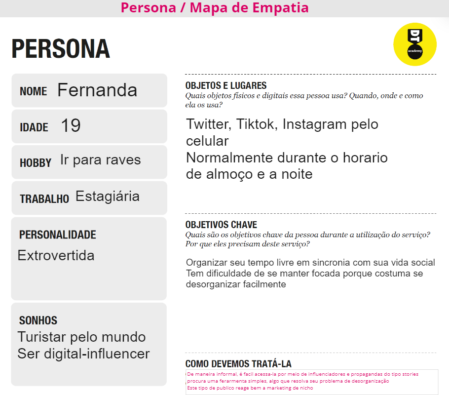
>
> 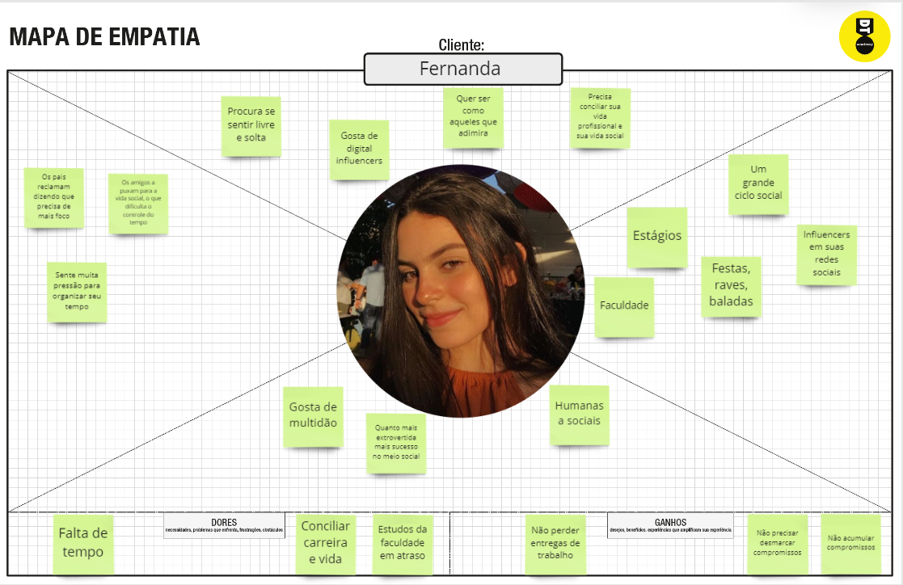
> 
> **Segunda Persona**
> 
> 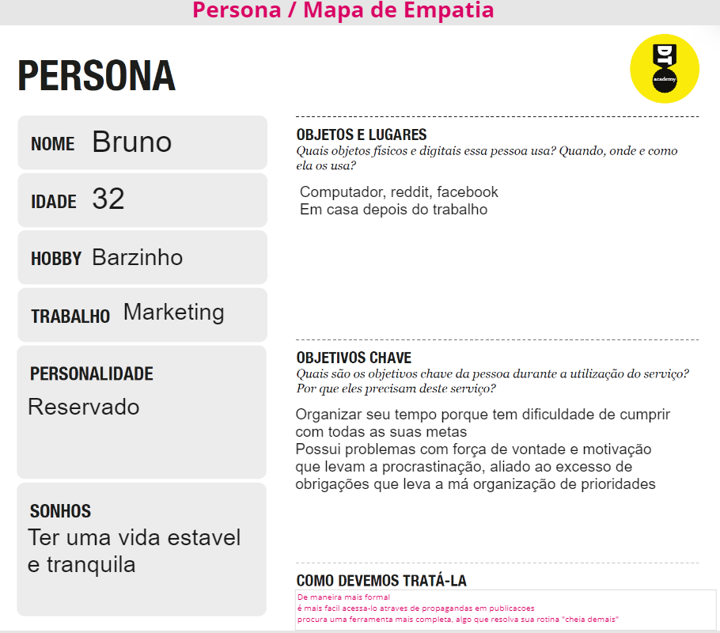
>
> 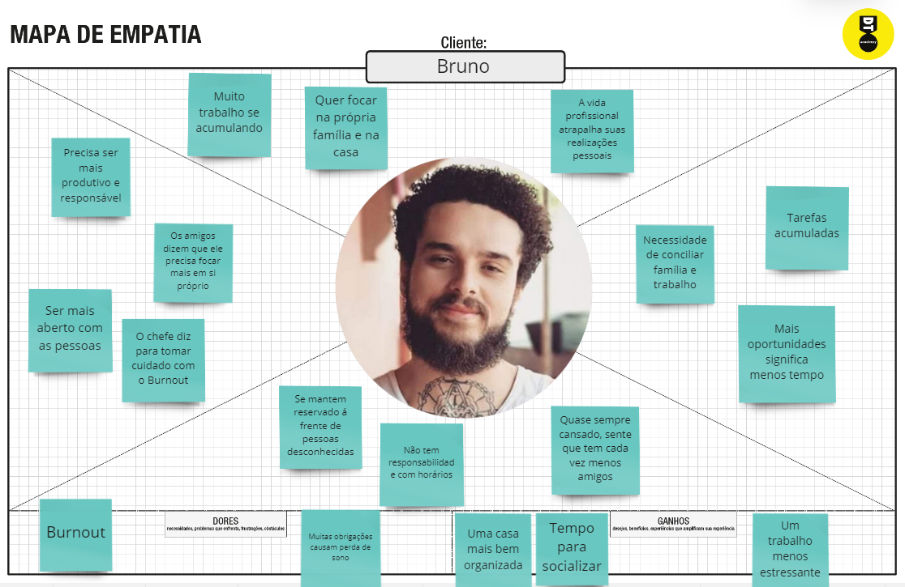
> 
> **Terceira Persona**
> 
> 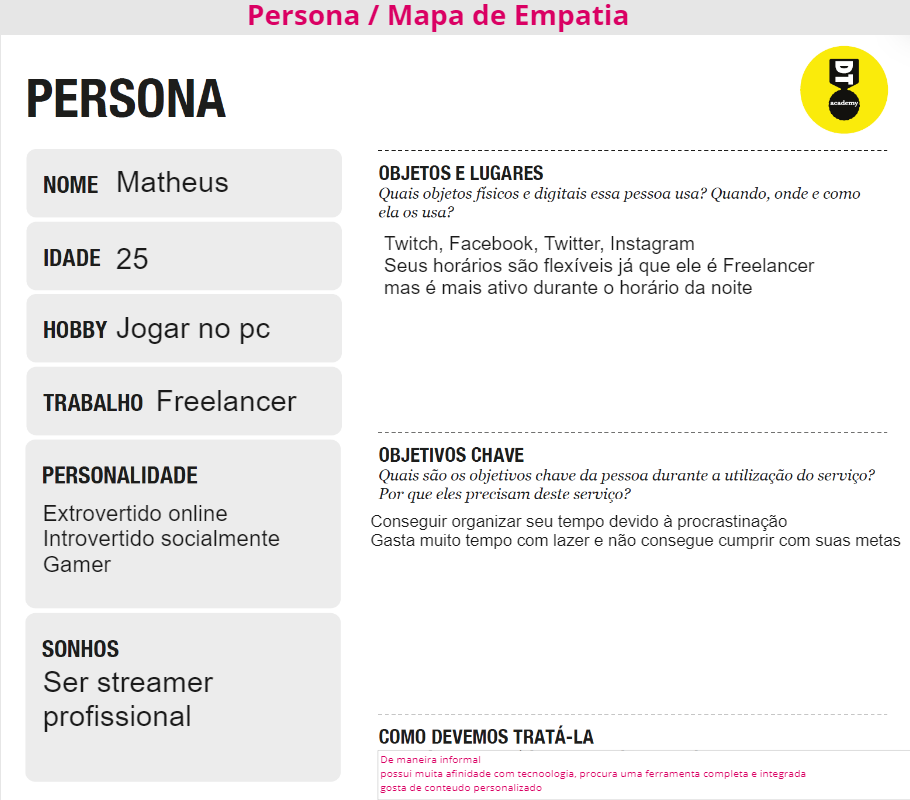
>
> 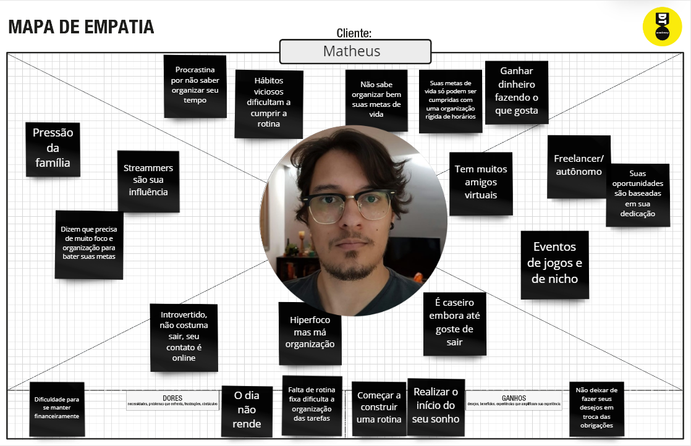

## Histórias de Usuários

Com base na análise das personas forma identificadas as seguintes histórias de usuários:

|EU COMO... `PERSONA`| QUERO/PRECISO ... `FUNCIONALIDADE` |PARA ... `MOTIVO/VALOR`                 |
|--------------------|------------------------------------|----------------------------------------|
| Fernanda | Precisa conciliar sua vida profissional e sua vida social | Passar mais tempo com seus amigos  |
| Fernanda | Organizar os estudos da faculdade em atraso  | Passar de semestre na faculdade |
| Fernanda | Não precisar desmarcar compromissos | Não parecer uma pessoa desleixada |
| Bruno | Organizar melhor o seu horário de trabalho | Não ter muito trabalho se acumulando |
| Bruno | Precisa ser mais produtivo e responsável | Produzir mais em menos tempo |
| Bruno | Ter horários bem definidos | Ter um trabalho menos estressante |
| Matheus | Organizar bem suas metas de vida | Conseguir enxergar claramente os seus objetivos |
| Matheus | Organizar seu tempo | Parar de procrastinar |
| Matheus | Definir uma rotina fixa | Facilitar a organização de suas tarefas |

## Requisitos

As tabelas que se seguem apresentam os requisitos funcionais e não funcionais que detalham o escopo do projeto.

### Requisitos Funcionais

|ID    | Descrição do Requisito  | Prioridade |
|------|-----------------------------------------|----|
|RF-001| Relatório de produtividade | BAIXA |
|RF-002| Controle de frequência de notificação | MEDIA |
|RF-003| Nivel de complexidade customizável | BAIXA |
|RF-004| Página com artigos | MÉDIA |
|RF-005| Utilização de paleta de cores pastel | ALTA |
|RF-006| Calendário com lembretes | ALTA |
|RF-007| Relatório de produtividade | BAIXA |
|RF-008| Planner | ALTA |
|RF-009| Diferentes notificações e anotações | BAIXA |
|RF-010| Temas diferentes para o site | BAIXA |
|RF-011| Contato de especialistas e profissionais | MÉDIA |
|RF-012| Integração multiplataforma | BAIXA |

### Requisitos não Funcionais

|ID     | Descrição do Requisito  |Prioridade |
|-------|-------------------------|----|
|RNF-001| Sistemas de recompensas | MÉDIA | 
|RNF-002| Sistema de fidelidade |  BAIXA | 
|RNF-003| Assistente virtual personalizável (sistema de recompensas) | BAIXA |
|RNF-004| Assistente virtual que auxiliará o usuário | ALTA |
|RNF-005| Planilha personalizada | ALTA |
|RNF-006| Mensagens incentivadoras | MÉDIA |
|RNF-007| Tela de chat para ajuda | BAIXA |

## Restrições

O projeto está restrito pelos itens apresentados na tabela a seguir.

|ID| Restrição                                             |
|--|-------------------------------------------------------|
|01| O projeto deverá ser entregue até o final do semestre |
|02| Não pode ser desenvolvido um módulo de backend        |
|03| O projeto deve utilizar apenas HTML, CSS, JS          |
|04| O projeto deve ser feito utilizando metodologias      |
|05| A evolução do projeto deve ser feita em reunião       |

# Projeto de Interface

Estamos nos preocupando com a qualidade da interface do usuário, sendo ela caracterizada por ser limpa e minimalista, mas extremamente funcional. Sendo assim, o projeto acaba tendo uma identidade visual além de fácil e intuitiva, fortalecendo a fixabilidade da aplicação na rotina de nossos usuários.

## User Flow

O diagrama a seguir apresenta o fluxo que o usuário irá tomar dentro do site-aplicação
sendo a tela incial um login juntamente com uma apresentação simples do aplicativo
Para visualizar o wireframe interativo, acesse: https://www.figma.com/proto/U4ycqEjCBOnQNSwdEny9Kf/Untitled?node-id=3%3A86&scaling=min-zoom&page-id=0%3A1&starting-point-node-id=3%3A86

Para visualizar o wireframe pelo aplicativo do figma, acesse: https://www.figma.com/file/U4ycqEjCBOnQNSwdEny9Kf/Untitled?node-id=6%3A1339

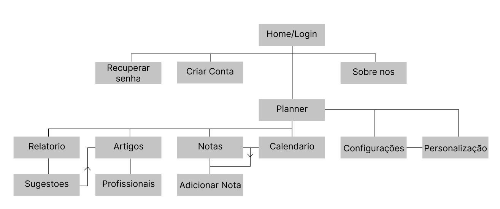

## Wireframes

De acordo com o userflow apresentado no artigo acima, o site terá uma tela de login distinta à sua funcionalidade
Sobre esta primeira tela, ela será separada em 2 partes:
Barra esquerda - Explicações e breves resumos sobre o site
Tela interativa - possuirá a parte de login ou recuperação de senha

Esta tela principal sera divida em 5 subdivisoes sendo estas:

1 - Home/Login

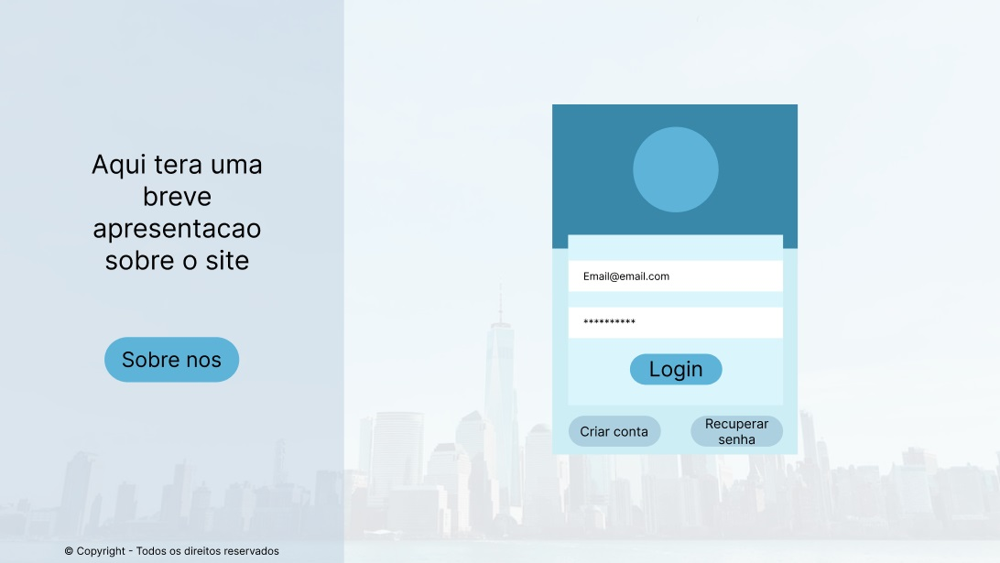

2 - Recuperar Senha

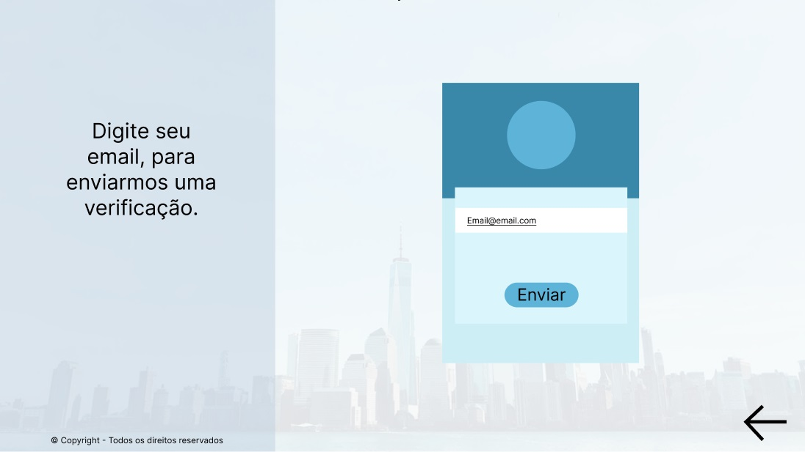

3 - Criar Conta

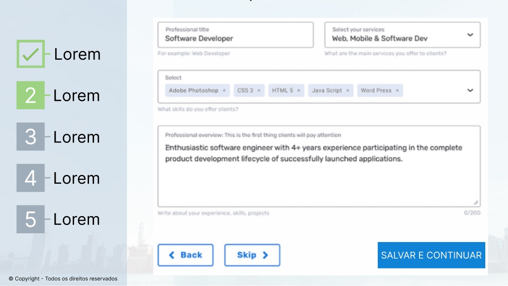

4 - Sobre Nós

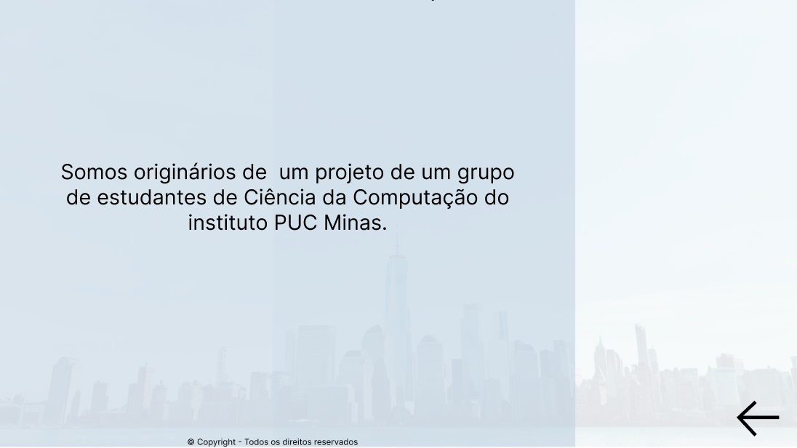

Conforme se segue o fluxo ira para a tela principal do site onde terao 3 telas principais
Estas telas terão sempre um padrão de barra lateral, com ajustes, configuracões, opções extras e navegações
A barra lateral possuirá notas padronizadas e personalizadas que poderão ser indexadas ao Planner/Calendário
Assim sendo estas telas serão:

1 - Planner

Será a tela inicial do site, com as informações necessárias com fácil visualização
As notas serão dispostas baseadas em tempo de duração, nível de relevância e sua categoria
será uma espécie de calendário de visualização semanal

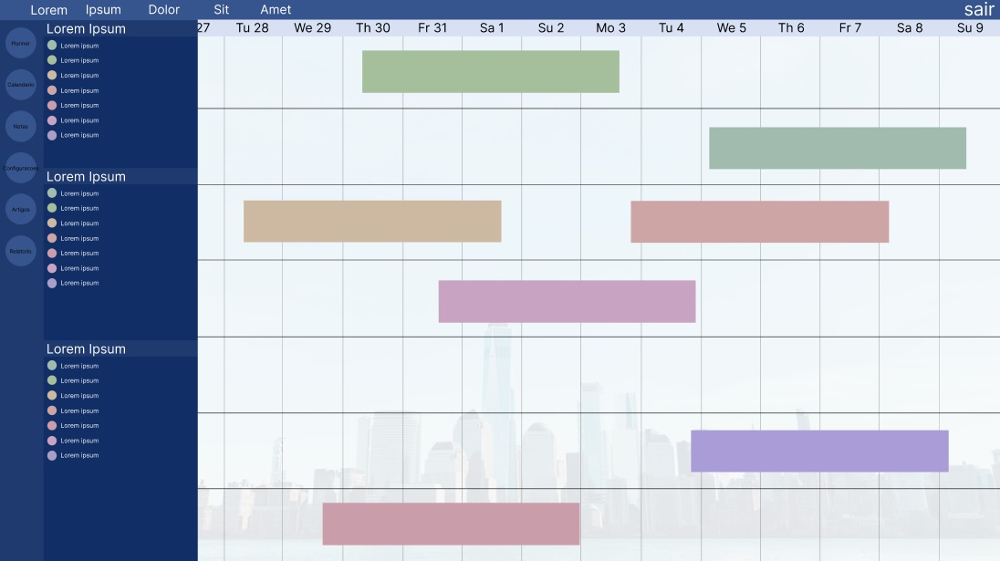

2 - Calendário

Uma versão modificada do Planner onde as informações serão dispostas baseadas em um calendário mensal

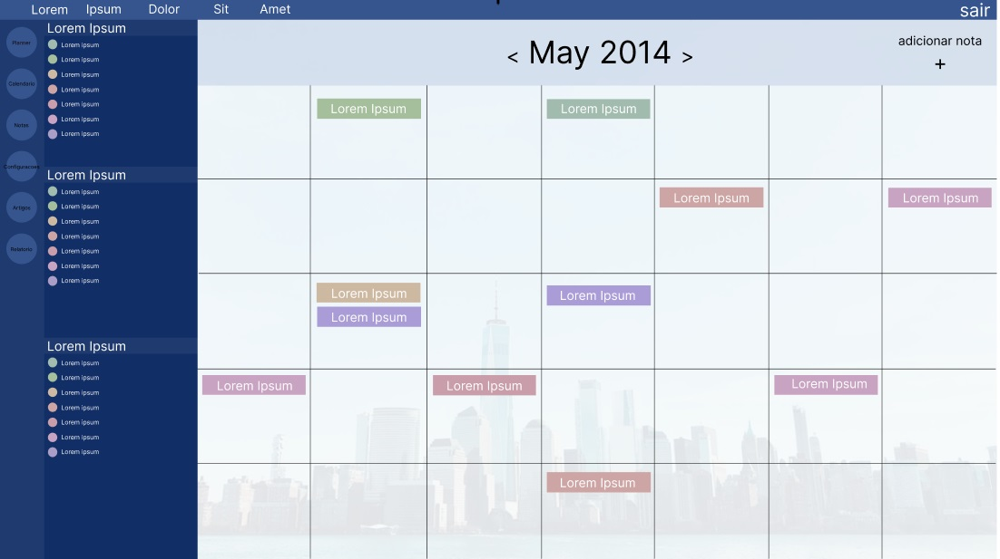

3 - Notas

Puramente as notas em ordem cronológica ou de importância, sem marcação de dias

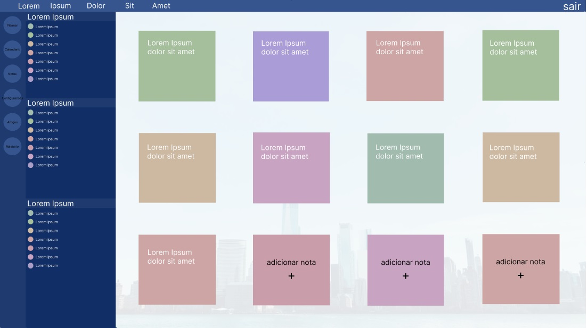

3.2 - Adicionar notas

Uma tela dedicada a configuração da nota, para aquelas pessoas que buscam uma experiência mais avancada de como configurar sua rotina

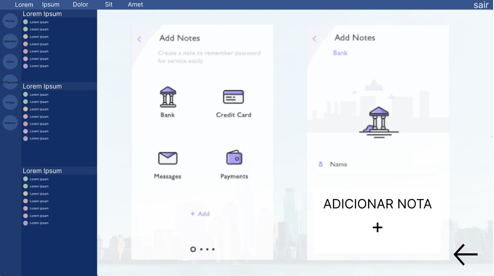

A partir destas existirão as telas secundárias que nao visam a visualização das notas e sim uma experiência mais avancada para aqueles que buscam profundidade no aplicativo.
Estas serão:

1 - Relatório

Parte dedicada a ver estatisticas de como sua experiência está ocorrendo,
assim como relatado na pesquisa 100% das pessoas responderam que acreditavam que uma melhor organização de sua vida traria melhorias significativas a sua vida pessoal e profissional, impactando diretamente seu rendimento financeiro e uma melhor qualidade de vida
por isso a importância de um relatório, para que possa ser provado diretamente ao usuário a diferença da utilização do site.

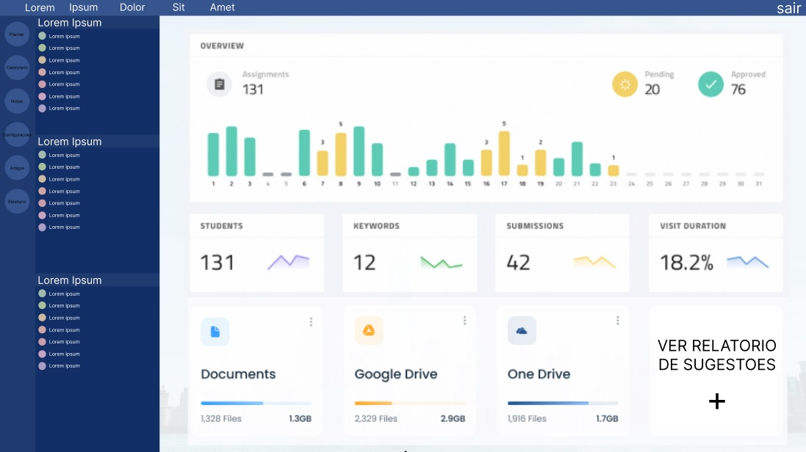

1.2 - Sugestões

Sessão baseada em analisar os dados do usuário para aqueles que buscam uma experiência o mais avancada possível
tendo retorno de artigos profissionais ou contato com profissionais que possam auxiliar em seu crescimento, baseado naquilo que gera a origem de seu problema

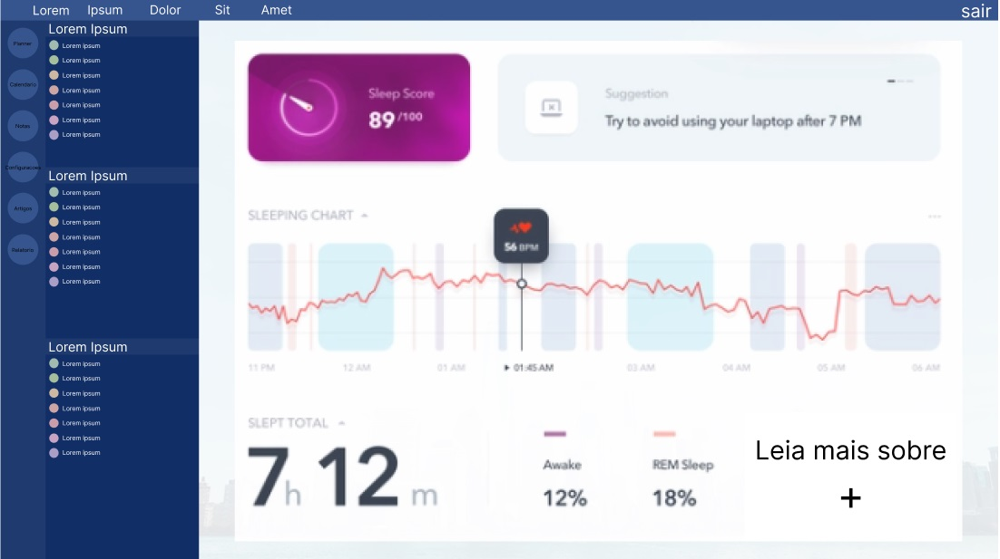

2 - Artigos

Os artigos sao baseados em sessões de auto-ajuda, recomendação de livros, técnicas e métodos que possam complementar a rotina de quem utiliza a aplicação

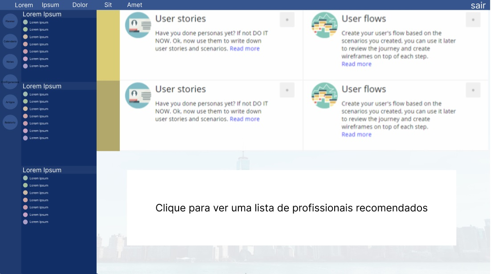

2.2 - Profissionais

Lista de profissionais parceiros que podem auxiliar o usuário, baseados em suas necessidades que o levaram a procurar um site/aplicação sobre procrastinação e organização.

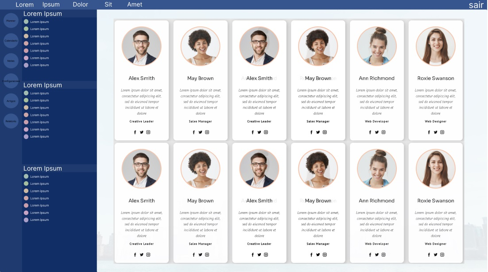

Além destas telas existirá a parte de configurações, que se divide em duas:

1 - Configurações

Configuracões da conta em geral e tudo aquilo que abrange a experiência do usuário

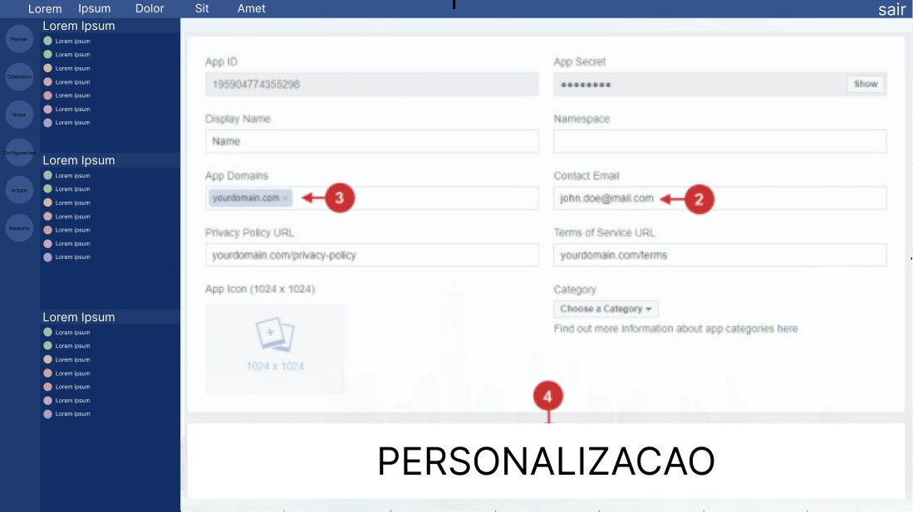

2 - Personalização

Pessoas com necessidades diferentes precisam de ambientes diferentes
nosso site abrange públicos com caracteristicas que distinguem de procurar uma experiência básica ou avançada ou gosto por temas que se encaixam melhor em sua personalidade, como os clássicos temas claro e escuro.

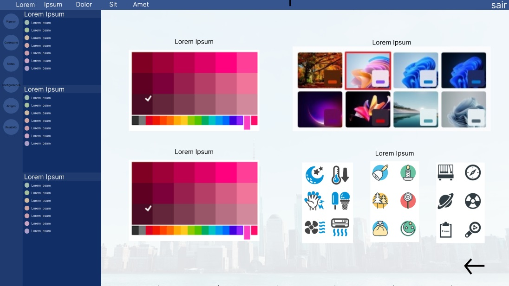

# Metodologia

A metodologia que usamos contemplou o uso de diversas ferramentas de trabalho para assim uma melhor diversificação de funcões no grupo.
Foram utilizados: 

Github para o controle de versão e repositório de código, metodologia, documentação e tudo aquilo que for feito no projeto.

Utilizamos o google forms para fazer uma entrevista com o nosso público-alvo, tendo juntamente a isto a entrevista presencial para uma melhor qualidade de resultados

O Miro foi utilizado para criar e discutir todo o processo de design thinking, todo este foi feito em maior parte presencialmente com todos do grupo e escrito em conjunto atraves da discussão de ideias e análise qualitativa das entrevistas, tanto as realizadas pessoalmente quanto aquelas quantitativas feitas pelo forms

Usamos o Figma para construir o userflow baseado nas ideias discutidas e concluídas através do Miro (persona e processo de design thinking) e tentar implementá-las de maneira funcional no site. Junto a isto no Figma também foi construido o Wireframe do projeto para servir como base para a construção do template do site.

Por fim durante todo o projeto também foi utilizado um grupo no discord para termos controle da divisão de tarefas e divisão de funções, estas cujo quais ficaram muito bem definidas sendo um membro líder de cada parte do projeto para guiar e delegar as funções relacionadas a sua parte para os outros membros do grupo.

Decidimos além disto utilizar o VSCode para escrevermos o código do programa
E a ferramenta Trello foi decidida para fazer a divisão de tarefas que será realizada durante a criação do código do site.

Utilizamos por fim o Google Presentation para fazer a criação de slides de apresentação para explicar o nosso projeto, que foi feito junto do Slidesgo onde foi retirado o modelo de apresentação utilizado.

## Divisão de Papéis

  Além das funções pré-definidas abaixo, todos os membros do grupo participaram da elaboração de determinadas partes do projeto, como o Miro, e algumas participaram de outras pequenas partes, fora das suas específicas.

> Matheus - Repositório Github

> Marcos Antônio - Repositório Github e Figma

> Gabriel Ramos - Documentação

> Dênis Soares - Documentação (saiu do curso)

> João Vitor Romero - Apresentação slides, Figma e um pouco do Github

> Gabriel Vinci - Apresentação slides

## Ferramentas

Assim como explicado acima, abaixo se encontram os links das ferramentas utilizadas juntamente com o link do nosso projeto dentro delas:

| Ambiente  | Plataforma              |Link de Acesso |
|-----------|-------------------------|---------------|
|Processo de Design Thinkgin  | Miro | https://miro.com/app/board/uXjVOAUNaP0=/ | 
|Repositório de código | GitHub | https://github.com/ICEI-PUC-Minas-PMGCC-TI/tiaw-pmg-cc-m-20221-procrastinacao-1-t1-g7 |
|Protótipo Interativo | Figma | https://www.figma.com/file/U4ycqEjCBOnQNSwdEny9Kf/Untitled?node-id=6%3A1339 | 
|Editor de código | VSCode | https://code.visualstudio.com | 
|Comunicação entre o grupo | Discord | https://discord.gg/bvRCNbwk |
|Formulario do google | Forms | https://forms.gle/dHjjc395aqf5xT1y8 |
|Padrao de slides | Slidesgo | https://slidesgo.com/pt |
|Criacao de slides | Workspace | https://workspace.google.com/intl/pt-BR/products/slides |
|Resultado da pesquisa | Forms | https://docs.google.com/forms/d/1JsHhjSWS_8ko8sxOILNrSzmygGmtweiRA6NdtYKjU9k/edit#responses |
|Apresentacao de Slides | Docs | https://docs.google.com/presentation/d/1ap0tOci9GqX-A4SL1uXNS-87tgkDFLg-rE71AcwHzXc/edit?usp=sharing |

## Controle de Versão

O site vai ser divido em versões que utilizarão 3 dígitos, sendo estes:

1 - Atualização master

2 - Atualização parcial estável

3 - Atualização de bugfix ou atualização de código sem implementação visual

Exemplo:

2.5.1

2 = Segunda grande implementação estável

.5 = Quinta parte de implementação parcial, mas ainda não caracteriza uma mudança significativa

.1 = Bugs corrigidos

Utilizaremos também algumas tags para o desenvolvimento:

`master`: versão estável já testada do software

`unstable`: versão já testada do software, porém instável

`testing`: versão em testes do software

`dev`: versão de desenvolvimento do software

`bugfix`: uma funcionalidade encontra-se com problemas

`enhancement`: uma funcionalidade precisa ser melhorada

`feature`: uma nova funcionalidade precisa ser introduzida

`description`: uma melhoria no sistema de comentarios do codigo

`root`: uma modificação na base do sistema

`branch`: uma modificação que nao modifica outras partes do sistema

# **############## SPRINT 1 ACABA AQUI #############**

# Projeto da Solução

Para produzir nosso trabalho nos pensamos em plataformas ja existentes do mercado que geralmente deixam a desejar para aqueles que a usam.
Trabalhamos totalmente em cima do resultado obtido pela pesquisa que dizia o quanto todos percebiam a diferença que organizar melhor seu tempo faz em sua vida profissional e pessoal em diferentes aspectos e tentamos deixar isso claro na imagem do nosso trabalho como por exemplo a implementação da tela de artigos e a utilização de pontos por cumprimento de tarefas para criar um maior vinculo entre cliente/plataforma.
Usamos inicialmente um projeto open sorce criado pela microsoft para criação do calendario e modificamos ele de acordo com nossas necessidades.
O site visa ter uma aparencia semelhante as ferramentas de uso diario daqueles que trabalham com computação como, outlook, visual code, canvas e etc. Para que assim seja facil do usuario se acostumar com a aplicação.
As tecnologias usadas serão apresentadas e detalhadas abaixo.

## Tecnologias Utilizadas

Foram utilizados para a criação da aplicação:

> HTML e CSS:
sendo estes o kit basico de criaçao de qualquer aplicação web

> BOOTSTRAP:
O uso do boostrap foi indispensavel para manter um padrão visual entre todo o site, sendo este principalmente minimalista e com uma paleta de cores em tom pastel para que seja leve para a vista e facil de se acostumar, trazendo uma sensação de calma e prosperidade, sendo assim de facil a implementação atraves do bootstrap. Mas é importante dizer que o boostrap foi utilizado apenas como complemento ao CSS

> MDBOOTSTRAP.COM:
Utilizamos esta biblioteca de boostrap para minimizar ao maximo qualquer chance de bug ou incompatibilidade entre componentes

> JAVASCRIPT:
Tirando o calendario todo o javascript do site foi criado personalizado e a mao de acordo com a necessidade da pagina, todos os dados foram armazenados em localstorage para assim ter uma facil conversa entre as paginas do site, seja para fazer o controle de permissão, levar dados do usuario de um lugar para o outro ou para fazer a interação entre os dados do usuario e o javascript do calendario.

> FullCalendar.io:
Projeto OpenSource criado pela microsoft para um calendario automatizado e de facil controle e implementação para sistemas proprios.
O mesmo foi modificado para as necessidades da nossa aplicação

> Repl.it:
Plataforma online para publicação de dominios web de forma gratuita, foi utilizada para fazer os testes no nosso site de forma que se apresentasse igualmente para todos os desenvolvedores, sem que houvesse incompatibilidade entre sistemas e IDE's. Além de permitir a apresentação de uma previa do site.

> Visual Studio Code:
IDE's gratuita criada pela Microsoft que apresenta uma quantidade muito grande de ferramentas que facilitam o trabalho para a criação e desenvolvimento de um site, principalmente através de suas extenções como o Live Server que permite a visualização do site em tempo de edição do codigo. Todo o conteudo do site foi escrito e produzido dentro do VSCode.

As tecnologias fundamentais para a utilização do usuario são o html/css/bootstrap que estarão onipresentes em todo o momento em que o usuario estiver utilizando a aplicação. O javascript ira aparecer de 3 formas distintas, sendo estas primeiro durante o cadastro do usuario para tratamento de erros e registro das informações em Local Storage, segundo para a implementação do calendario e coração da aplicação fazendo o cadastro e apresentação das notas que o usuario configurar e por ultimo para a configuração personalizada do usuario, sendo este usuario unico atraves de sua conta.

Aqui podemos ver o User Flow da movimentação do usuario no site e pelas suas paginas
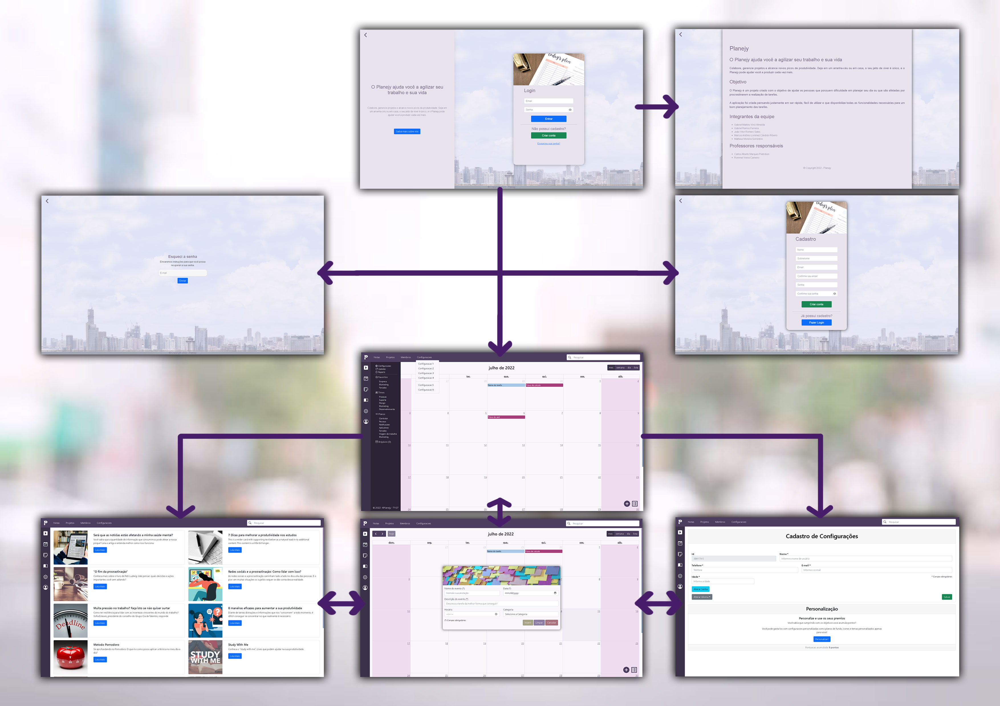

Como pode ser visto o site se resume em uma tela separada de Login com diversos pontos como Descrição da empresa, Criação da conta, Recuperação de Senha e o mais importante o proprio Login
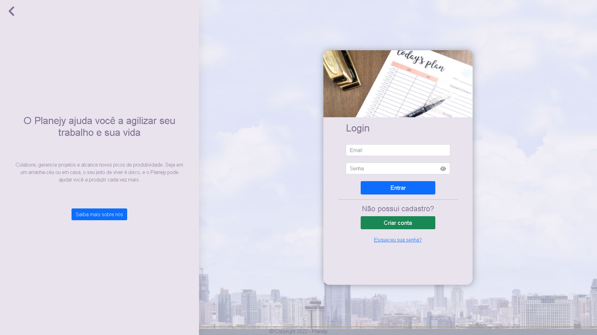

Em seguida o coração do site esta no calendario junto com o cadastro de notas que pode ser visto aqui:
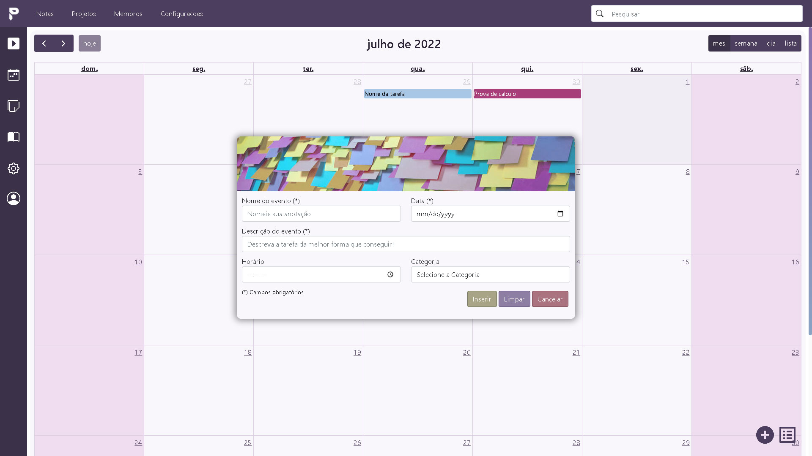

O calendario possui acesso para mais duas partes, sendo estas
1 - A tela de Artigos
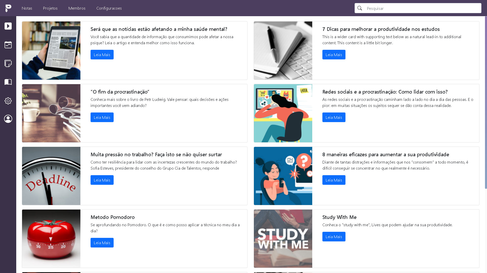

2 - A tela de configurações do usuario
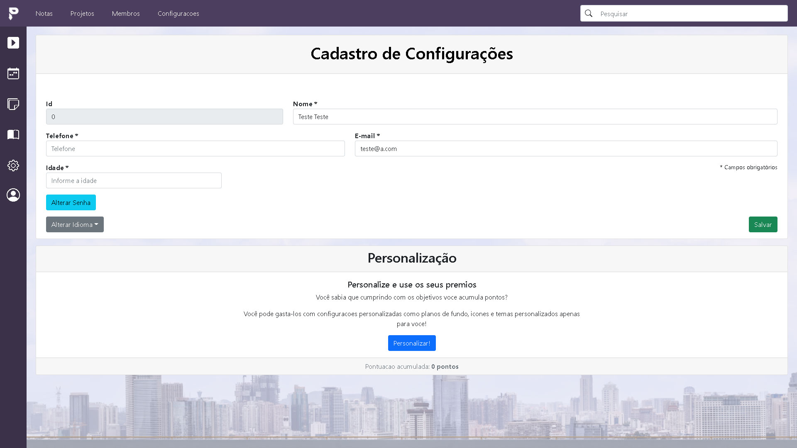

## Arquitetura da solução

Apresentamos aqui o diagrama do funcionamento do site no atual momento
Levando-se em conta a limitação de nao poder ser usado backend

Assim como ja explicado as tecnologias usadas foram todas baseadas em funcoes javascript para controle da D.O.M. e validação de entrada de dados
juntamente trabalhadas com HTML/CSS, sendo o CSS em maior parte estilizado atraves do Bootstrap e padronizado com a ajuda do MDBootstrap
Por fim a utilização de LocalStorage para armazenamento das informações e o uso do calendario.io para controle do calendario
Tudo isso esta armazenado na plataforma Repl.it para acesso livre

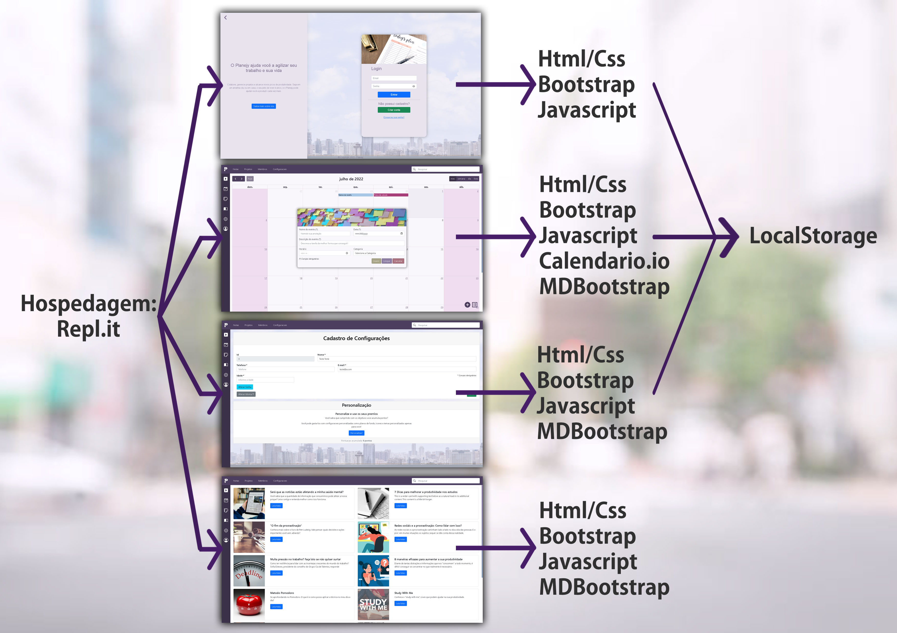

# Avaliação da Aplicação

Na tela de login foram feitos diversos testes e tratamentos de erros, aqui apresentamos eles:
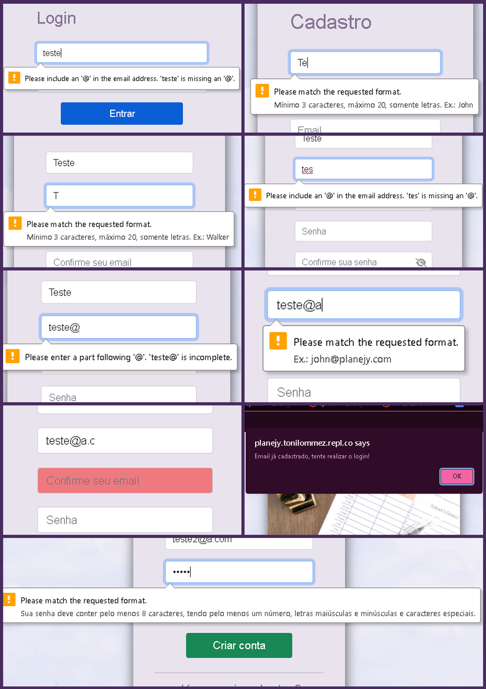
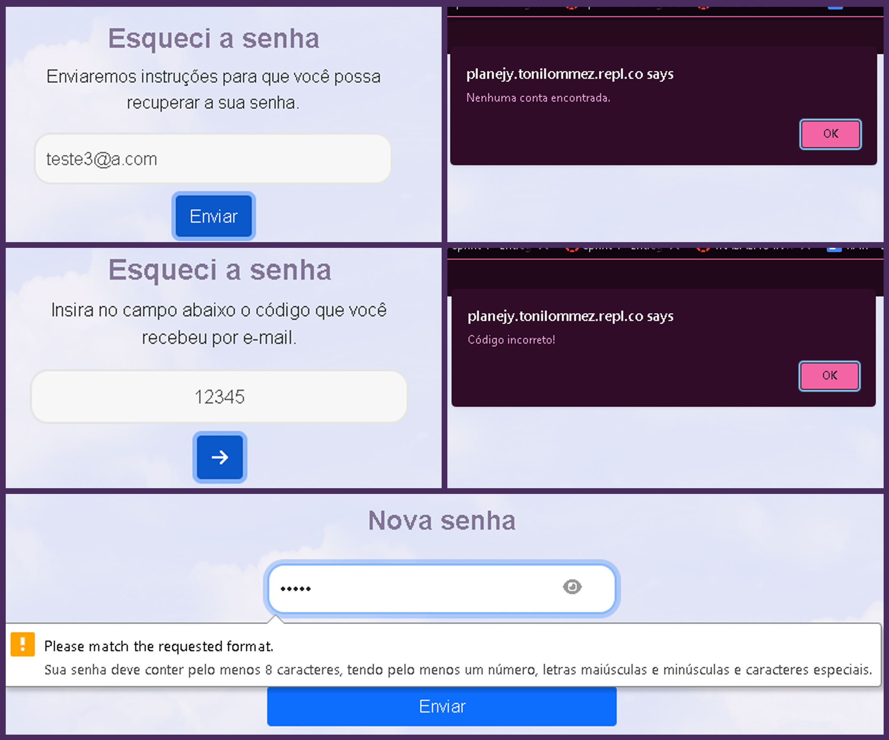

Na tela de cadastro de notas podemos mostrar aqui os tratamentos de erros são prevenidos por funções nativas do html que controlam a entrada de dados apresentando automaticamente um calendario para escolha da data que automaticamente rejeita tadas invalidas + um relogio onde você pode selecionar a hora clicando que automaticamente corrige valores invalidos
As cores das notas são controladas pelo tipo de dado que você escolhe, como trabalho, dia-a-dia, lazer e estudo

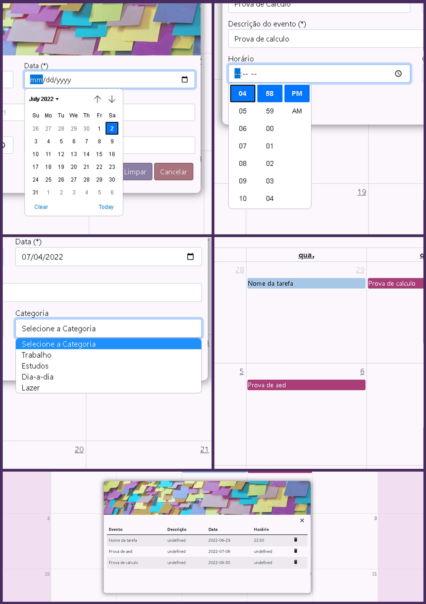

## Plano de Testes

Os planos de testes foram detalhados no topico acima, eles foram feitos atraves inicialmente de um planejamento de possiveis erros, em seguida uma pesquisa de testes necessarios, em seguida a implementação junto com testes paralelos e por fim uma bateria de testes realizado por 5 pessoas diferentes para se achar possiveis erros ou falhas junto com suas posteriores correções.

## Registros de Testes

Na pagina de Login foram encontrados muitas formas diferentes de falha de entrada, em sua maioria foram feitos tratamentos que prevenissem a inserção de dados de diferentes tipos, assim também prevenindo diversas falhas de segurança. Alguns tipos de erros não são necessarios fazer tratamento devido as suas essências como por exemplo alguem tentando recuperar uma conta que nem sequer foi criada, sempre sera apresentado um erro de conta não encontrada, sendo que todos os sites funcionam com está arquitetura erros como estes não precisam ser tratados.

Dentro do site existem outros erros possiveis como a inserção de dados invalidos na criação das notas do calendario, estes erros são prevenidos com a opção do usuario entrar com o dado atraves de um mini calendario, selencionando manualmente o dia em vez de digita-lo e também o mesmo para a hora sendo selecionada em um relogio, lembra-se que cada uma dessas funcionalidades é herdada do browser que estiver sendo utilizado se tornando não possivel trata-las caso o browser não possua esta opção. Para evitar a inserção de mes no lugar do dia e vice versa é feito uma sugestão de dados em forma de placeholder e controle de tipagem com pattern, mas ainda não é possivel identificar possiveis falhas caso a pessoa não se atente ou a conversão automatica de dados do browser falhe.

# Referências

......  COLOQUE AQUI O SEU TEXTO ......

> Inclua todas as referências (livros, artigos, sites, etc) utilizados
> no desenvolvimento do trabalho.
> 
> **Links Úteis**:
> - [Formato ABNT](https://www.normastecnicas.com/abnt/trabalhos-academicos/referencias/)
> - [Referências Bibliográficas da ABNT](https://comunidade.rockcontent.com/referencia-bibliografica-abnt/)
